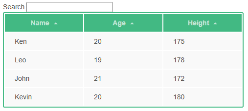

# 可复用的表格组件



## 注册组件

定义组件的好处在于可以对其进行任意次数的复用，每一次复用都是创建一个独立的实例。组件与根实例接收相同的选项，例如 `data`、`computed`、`watch`、`methods` 以及生命周期钩子等。

组件注册通过`app.component`实现，

```js
app.component("demo-grid", {
  props:{
    headers: Array,
    records: Array
  },
  template:"#grid-template"
})
```


### 组件参数

`props`定义了使用组件时需要传入的参数，这些参数会成为该组件的自定义属性。有两种常用的定义方式：

+ 字符串数组，例如`['headers','records']`；
+ 对象形式，对象每个属性的键值分别是各自的名称和类型，上面就是采用了这种方式。

组件的实例化和传参方法如下：

```html
<demo-grid 
:headers="gridHeaders"
:records="gridRecords">
</demo-grid>
```


### 模板定义

`template`定义了组件的DOM模板，当模板长度较短时可以直接定义，例如：

```js
template: `<li>{{ value }}</li>`
```

如果较长，可以用`x-template`的方式定义，即模板内容卸载HTML文件中，js文件中使用`#`符号引用。例如本项目中定义的模板：

```html
<script type="text/x-template" id="grid-template">
<!-- ... -->
</script>
```

需要注意的是，模板中使用的变量都是在组件`demo-grid`定义的，根组件实例中的变量对它是不可见的。


## 循环渲染表格

表格的头、记录都需要通过循环来渲染，Vue循环的指令为`v-for`，例如本项目中的一处循环：

```html
<tr v-for="row in records">
  <td v-for="key in headers">
    {{row[key]}}
  </td>
</tr>
```

`records`和`headers`都是组件定义的属性，他们的类型都是数组，所以`row`代表的就是每行记录，`key`代表每个列名。


## 绑定元素Class

我们可以传给 `:class` (`v-bind:class` 的简写) 一个对象，以动态地切换 class：

```html
<th :class="{active: sortKey == key}"></th>
```

上面的语法表示 `active` 这个 class 存在与否将取决于组件变量`sortKey`和局部变量`key`是否相等。

CSS文件中给出了`active`类的样式定义，

```css
th.active {
  color: #fff;
}
```

`:class`可以和普通的`class`共同应用，比如下例中传递给`:class`一个JavaScript表达式，在两种箭头样式中进行切换。

```html
<span class="arrow" :class="ascOrders[key]?'asc':'dsc'"></span>
```


## 记录排序

将DOM模板中的`row`改为对函数`sortRecords`返回值的迭代，

```html
<tbody>
  <tr v-for="row in sortRecords">
    <td v-for="key in headers">
      {{row[key]}}
    </td>
  </tr>
</tbody>
```

排序的工作就在函数`sortRecords`中完成，它是一个计算属性，仅当依赖变量`sortKey`、`ascOrders`、`records`发生变化时执行。

```json
computed:{
  sortRecords(){
    let sortedRecords = this.records
    if (this.sortKey){
      sortedRecords = sortedRecords.sort((a, b)=>{
        a = a[this.sortKey]
        b = b[this.sortKey]
        return (a === b ? 0 : (a > b ? 1 : -1)) * (this.ascOrders[this.sortKey] ? 1 : -1)
      })
    }
    return sortedRecords
  }
},
```


## 记录过滤

添加一个文本框，用于输入过滤信息。Vue 提供了 `v-model` 指令，它能轻松实现表单输入和应用状态之间的双向绑定——变量的更改能够反映到表单，表单内容的变化也会更新到绑定的变量。

```html
<input v-model="search"/>
```

在js文件中为应用添加全局属性`search`，并且为`demo-grid`组件增加一个参数`filterKey`。

过滤的操作也放在排序函数中，把原来的`sortRecords`函数改写为：

```json
sortAndFilterRecords(){
  let filterKey = this.filterKey
  let sortedRecords = this.records
  if (filterKey){
    filterKey = filterKey.toLowerCase() // 不区分大小写
    sortedRecords = sortedRecords.filter((row)=>{ // 迭代每行记录
      return Object.keys(row).some((key)=>{ // 迭代每行记录的每个列，只要有一个列符合就返回true
        return String(row[key])
              .toLowerCase()  // 不区分大小写
              .indexOf(filterKey) > -1 // 查找子字符串
      })
    })
  }
  if (this.sortKey){
    sortedRecords = sortedRecords.sort((a, b)=>{
      a = a[this.sortKey]
      b = b[this.sortKey]
      return (a === b ? 0 : (a > b ? 1 : -1)) * (this.ascOrders[this.sortKey] ? 1 : -1)
    })
  }
  return sortedRecords
}
```


