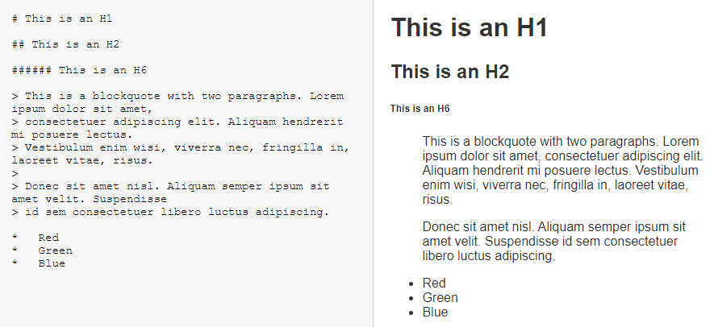

# 简易Markdown编辑器



## 属性绑定和事件处理

`v-bind`指令可以绑定元素属性值，这里的作用是将文本框的默认显示内容`value`和应用实例的`input`变量绑定。

`v-on`指令可以监听 DOM 事件，并且接收一个需要调用的方法名称，这里当用户在文本框输入内容时，就会调用`methods`选项里的`update`方法，该方法将文本框内容更新到变量`input`。

```html
<textarea v-bind:value="input" v-on:input="update"></textarea>
```

```js
data() {
    return {
      input: '# Heading1'
  }
}
methods: {
  update(e){
    this.input = e.target.value;
  }
}
```


## 防抖

文本框input事件的触发频率时无限制的，会加重浏览器的负担，导致用户体验非常糟糕。此时我们可以采用debounce（防抖）的方式来减少触发的频率，同时又不影响实际效果。

下图展示了防抖技术的原理——当持续有触发事件时，**debounce**会合并事件且避免触发，如果一定时间内没有再触发这个事件时，这时才真正去触发该事件。


Vue 没有内置支持防抖和节流，本项目使用 [Lodash](https://lodash.com/) 库来实现。

```js
methods: {
  update: _.debounce(function(e) {
    this.input = e.target.value;
  }, 1000)
}
```


## 计算属性

`computed`选项是Vue的计算属性，和`methods`方法不同的是，计算属性是有缓存的，并且只在相关响应式依赖发生改变时（本项目中为`input`变量）它才会重新求值。

本项目中将Markdown的渲染函数作为计算属性，每隔一段间隔才执行渲染，从而降低浏览器的负担。

```js
computed: {
  compiledMarkdown() {
    return marked(this.input, { sanitize: true });
  }
}
```

